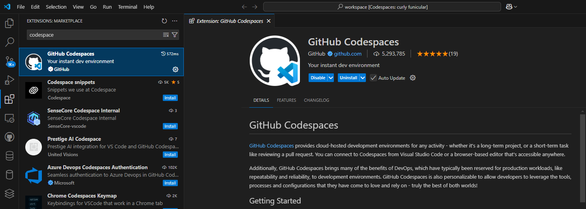
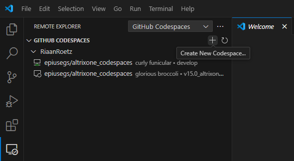
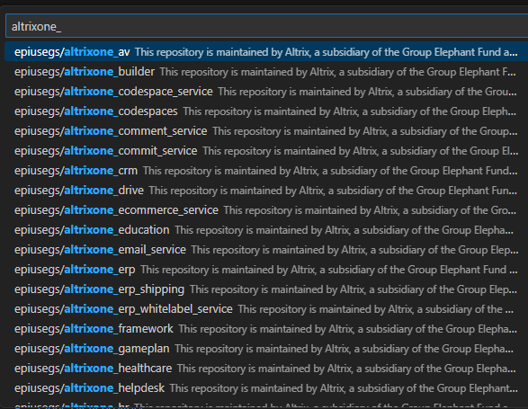
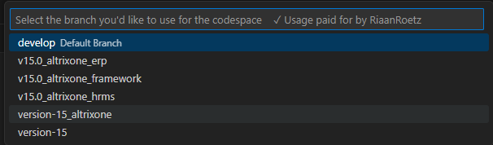
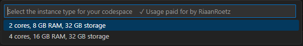
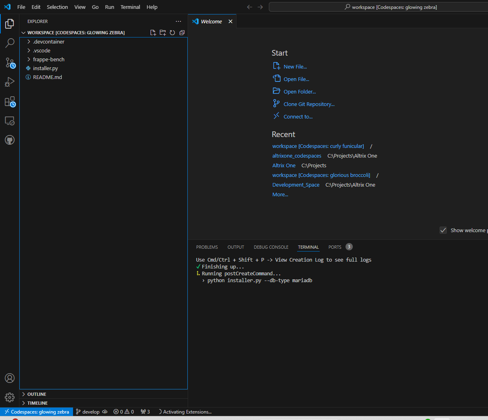
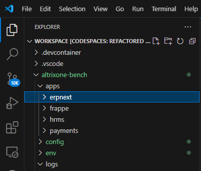
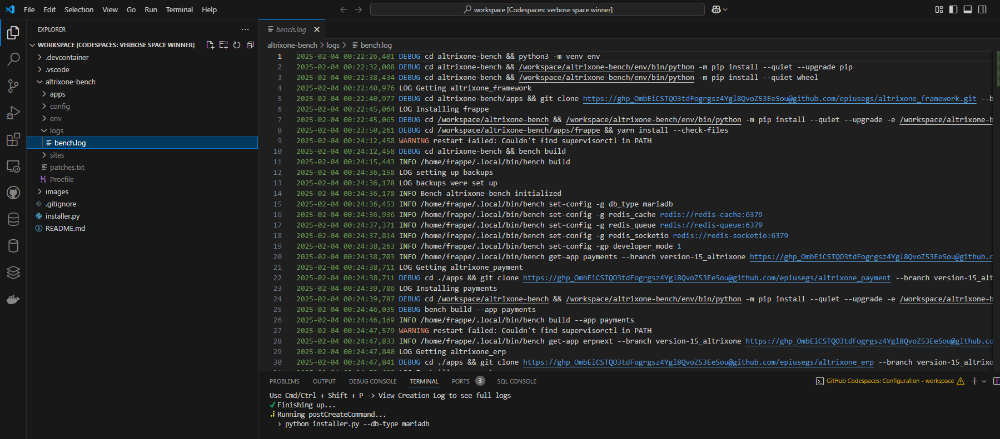
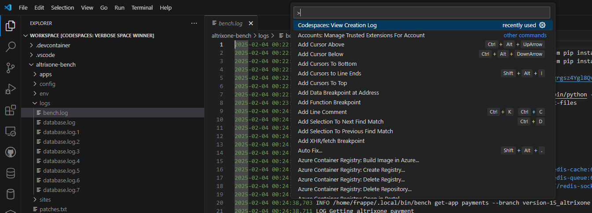
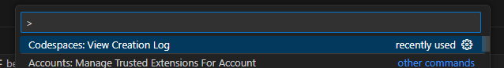

<div align="center">
    <h2>Chohenix Codespaces</h2>

</div>

This repository is maintained by Cohenix, a subsidiary of the Group Elephant Fund and part of the EPI-USE group of companies. Our solution builds on the Frappe.io framework, integrating custom modules tailored to client needs. For inquiries, terms of use or contributions, please contact the Cohenix development team at christiaan.swart@epiuse.com

## Introduction

Chohenix codespaces allow quick and easy setup of the development environment in the cloud or on local VS Code instance, a ready out of the box development environment.

## Chohenix Repositories

- cohenix_erp
- cohenix_hr
- cohenix_crm
- cohenix_learning
- cohenix_payment
- cohenix_insight
- cohenix_helpdesk
- cohenix_drive
- cohenix_gameplan
- cohenix_healthcare
- cohenix_education
- cohenix_raven
- cohenix_propvault
- cohenix_builder
- cohenix_pwabuilder

## Installation

### Install codespace plugin on VS Code

- Open VS Code
- Click on “Extensions” on the left hand menu bar
- Type in the search “codespace”
- Select “GITHub Codespaces” and install



### Running codespaces on VS Code

- Open VS Code
- Click on “Remote Explorer” on the left hand menu bar
- Click on + icon to “Create New Codespace”



- Type “cohenix_” in top search bar and all codespace you have access too will appear.



- Select “cohenix_codespaces” and then select the branch



- Select the virtual environment



- Wait for the codespace to spin up, the first time you spin up the codespace may take longer.



### Creating a dev or qa branch on your codespace in VS Code

- Open a terminal.
- Navigate to the “cohenix-bench” folder.

    ```sh
    cd cohenix-bench
    ```
    
- Navigate to the “apps” folder.

    ```sh
    cd apps
	```

- Navigate to the respective module you will be working on (example: erpnext, frappe, hrms, …)

    ```sh
    cd "enter your module"
    ```

- Use your story id, task id (ticket id) in all caps as your branch name. (example COHNX-123)



- Type in the following GIT commands and press enter after each command.  

	```sh
    git checkout -b COHNX-123
	```
	```sh
    git push
    ```

- If your branch is not being tracked you can use the following commands
	```sh
    git config --global --type bool push.autoSetupRemote true
	```

    or

	```sh
    git push --set-upstream origin COHNX-123
	```

- Your codespace has been created locally and remotely, you are ready to work!

## Troubleshoot problems with codespace in VS Code
### Unable to access repository
- Once the workspace start and you are able to view a folder structure in VS Code Explorer.
- Navigate to the “cohenix-bench\apps\( erpnext \ hrms \ ...) ” folder.
- Run the following GIT command.
	```sh
    git checkout version-15
    ```
- If the following error is reported: "error: pathspec 'version-15' did not match any file(s) known to git"
- Proceed with the following steps to Remove the remote site and re-add it.
	```sh
    git remote -v
    ```
- Copy the full url and take note of the remote site name (example: upstream)
- First remove the remote site.

    ```sh
    git remote remove upstream
    ```
    
- The re-add the remote site 

    ```sh
    git remote add upstream [paste url here]
    ```

- This should restore the remote site, pull the code as follow
    
    ```sh
    git pull --rebase
    ```

### How to view Logs

- Once the workspace start and you are able to view a folder structure in VS Code Explorer.
- Navigate to the “cohenix-bench\logs” folder.
- Select and open the “bench.log” file.



- Another more detailed log to check is.
- In VS Code, press ctrl + shift + p



- Select and click “Codespaces: View Creation Log”


