

    <h2>Cohenix - Frappe Local Development Container</h2>

This repository is maintained by Cohenix, a subsidiary of the Group Elephant Fund and part of the EPI-USE group of companies. Our solution builds on the Frappe.io framework, integrating custom modules tailored to client needs. For inquiries, terms of use or contributions, please contact the Cohenix development team at christiaan.swart@epiuse.com

## Introduction

Chohenix devcontainer allow quick and easy setup of the development environment on local VS Code instance, a ready out of the box development environment.

## Frappe Repositories

- cohenix_erp
- cohenix_hr
- cohenix_crm
- cohenix_learning
- cohenix_payment
- cohenix_helpdesk

## Index / Quick links
* [Prerequisites](#prerequisites)
* [How to Setup](#how-to-setup)
* [Git Commands](#git-commands)

## Prerequisites

    Please note:

    The following software and accounts are required to run a succefull docker development environment, if you have not installed or created accounts for the following please do so now before moving on.
    
    If you rquire instructions in how to install the following please refer to the Cohenix development resource: https://github.com/epiusegs/cohenix_dev_resources

- VS Code

      https://code.visualstudio.com/

- Git

      https://git-scm.com/

- GitHub

      https://github.com/

- Docker

      https://docs.docker.com/get-started/get-docker/

- Docker Desktop

      https://docs.docker.com/desktop/

## How to Setup

* [Initial Container Setup](#initial-container-setup)
* [Switch Between Containers](#switch-between-containers)

### Initial Container Setup
- Create a folder where you will clone the git repository projects (example: projects)
- Navigate to the folder
  - cd < your folder >

- Clone repository
  - git clone https://github.com/EPIUSECX/frappe_cohenix_development.git
  
    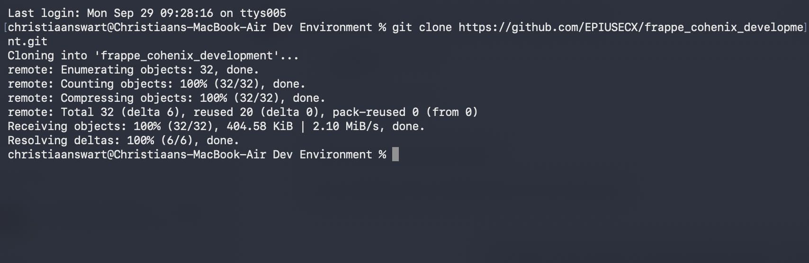

- Open VS Code and installed the following plugins.
  - Container Tools
  - Database Client
  - Database Client JDBC
  - Docker

    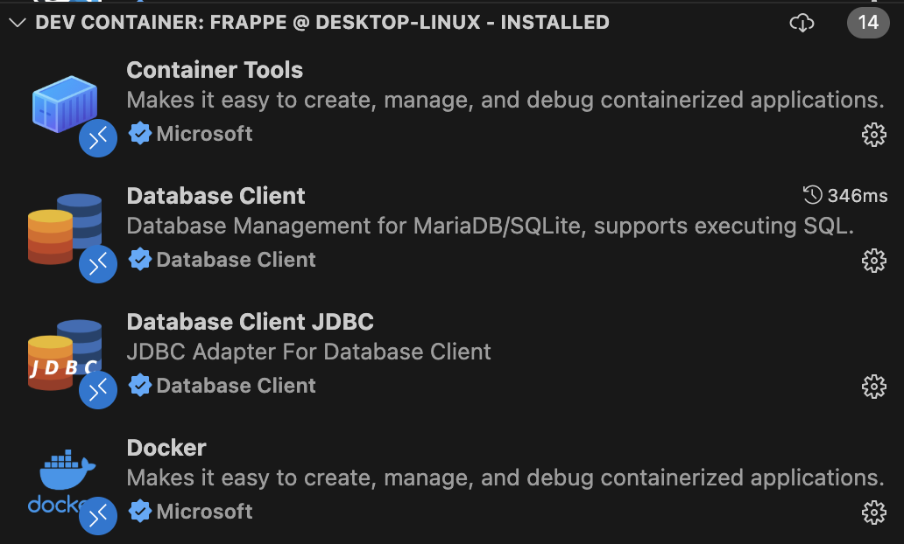
 
- While In VS Code select "Open folder"
- Navigate to the project folder that was created in first step
- Select the project that you have cloned
  - (example: frappe_cohenix_development)

    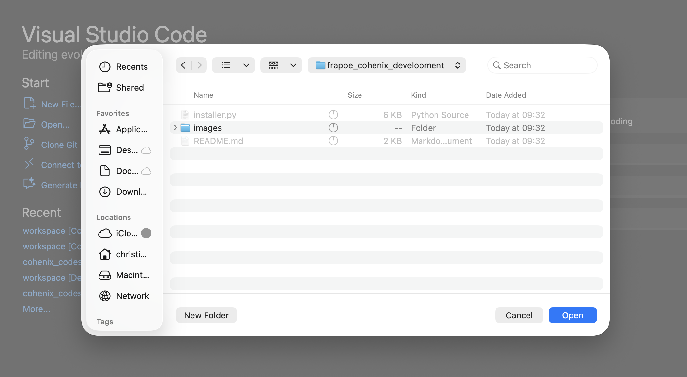
  
- VS Code will open the project and prompt you to "Reopen in Dev Container" click button to confirm:

    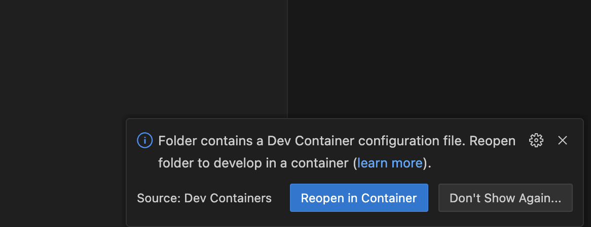
  
- The initial docker image will be pulled and installed, you can view the image in Docker Desktop:
  
    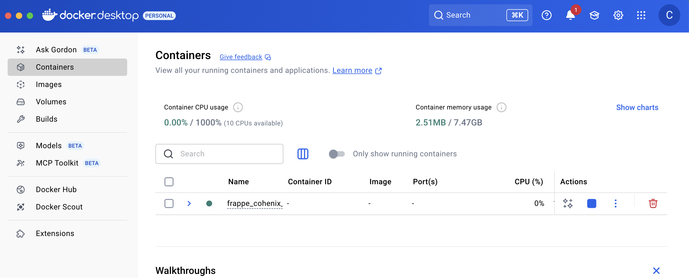
  
- In VS Code the script will then be run and you will be able to view the progress in the 
  "development-bench" Logs folder:
  
    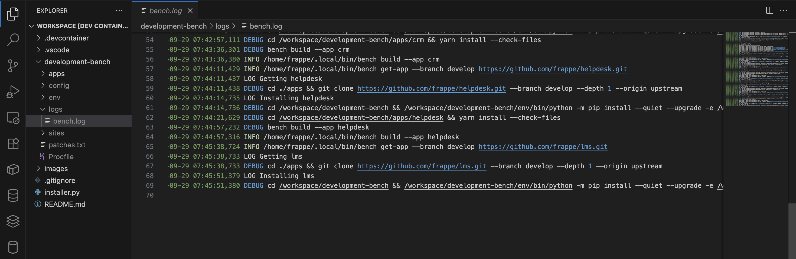

- Once the script has finished runnig you can now safely cd to the bench folder and run commands (cd development-bench/)

    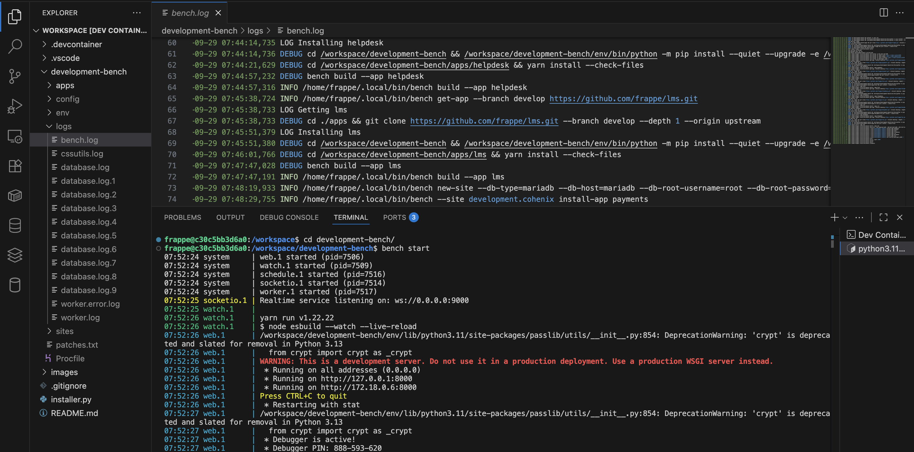

    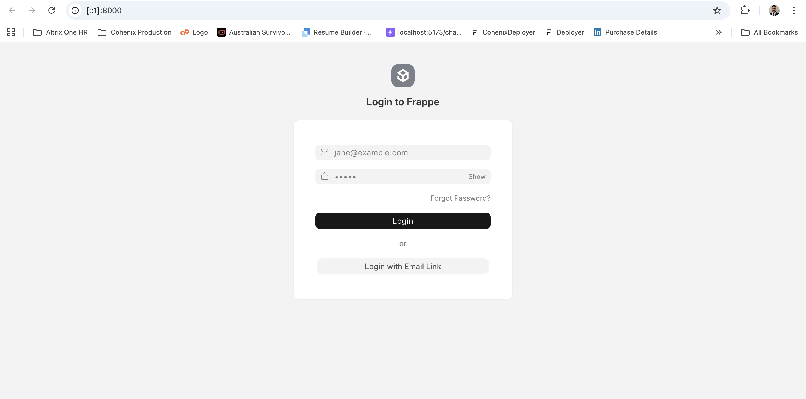

### Switch Between Containers
- To switch between containers navigate to the bottom left corner and select the container icon

    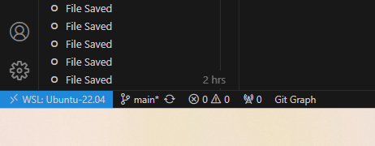

- Close the current remote connection if you are still in a docker container.

    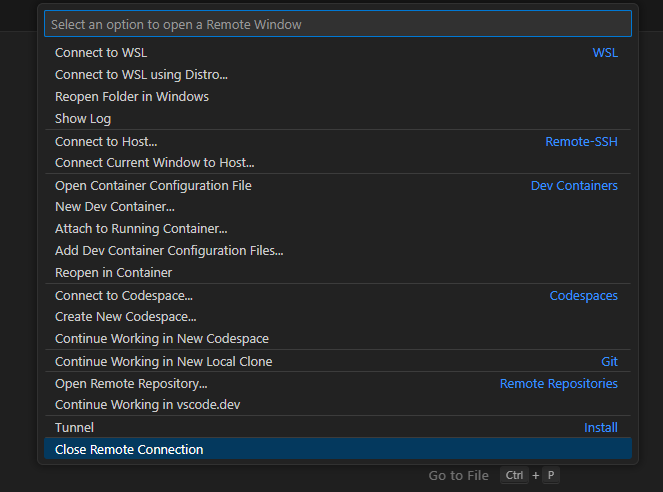

- Navigate to the Explorer sidebar, you will need to delete the folder "cohenix-bench" folder before recreating the container to avoid any conflicts.

    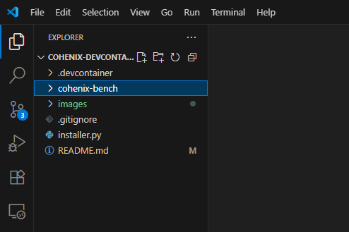

- Navigate to your VS Code Terminal, make sure you are in the "cohenix-devcontainers" folder.

    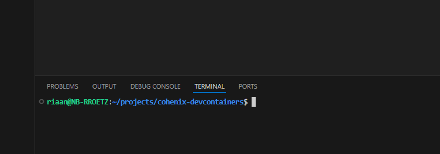

- Check your current branch and then switch to your intended branch or create a new branch
  - check your current branch

        git branch

      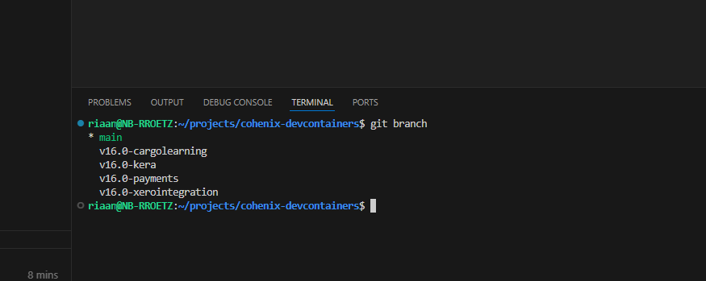

  - switch to your intended branch

      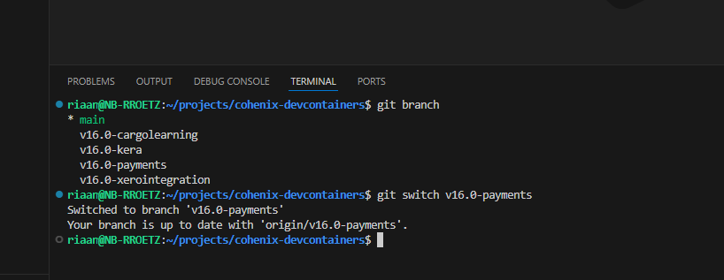

  - or Create a new branch

      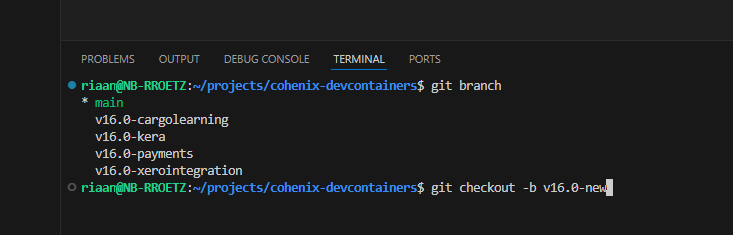

- Navigate to the bottom left corner and select the container icon

    

- Select reopen container

    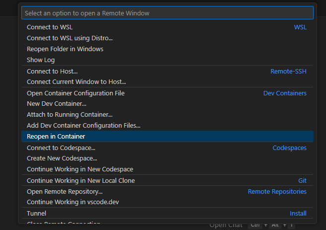

- The container wil re-open. Your VS Code frame change to blue indicating the you are in the containers.

    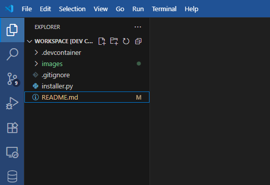

- The Container is still referencing the previous build so you will need to re-build the container.
- Navigate to the bottom left corner and select the container icon

    

- Select rebuild Container container

    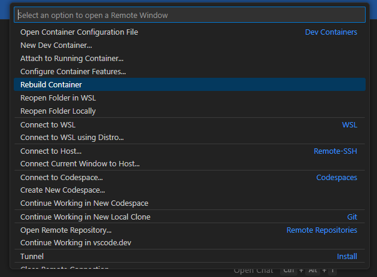

- Wait until the container is build, your container environment should be ready.

## Git Commands

### Setting up a Repository:
- Initializes a new Git repository in the current directory.

        git init

- Creates a local copy of a remote repository.

        git clone <repository_url>

- Sets your global username for Git commits.

        git config --global user.name "Your Name"

- Sets your global email for Git commits.

        git config --global user.email "your_email@example.com"

### Making and Saving Changes:
- Shows the status of your working directory and staged files. 

        git status

- Adds a specific file to the staging area. 

        git add <file_path>

- Adds all changes in the current directory to the staging area.

        git add .

- Records the staged changes to the repository with a descriptive message.

        git commit -m "Commit message"

### Branching and Merging:
- Lists all local branches.

        git branch

- Temporarily saves modified tracked files, allowing you to switch contexts and then reapply them later. 

        git stash

- Creates a new branch.

        git branch <branch_name>

- Switches to a different branch.

        git checkout <branch_name>

- Creates a new branch and switches to it. 

        git checkout -b <new_branch_name>

- Merges the specified branch into the current branch.

        git merge <branch_name>

### Working with Remote Repositories:
- Uploads local commits to the remote repository.

        git push

- Fetches and merges changes from the remote repository.

        git pull
